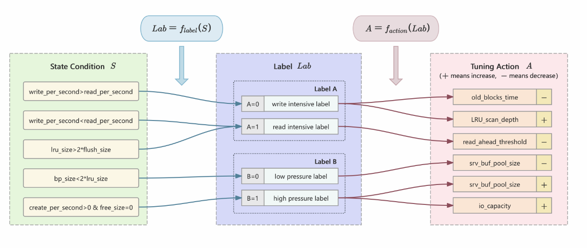

# DRETune: Accelerating Database Parameter Tuning Under Sample Deficiency
This repository contains the source code for the paper "DRETune: Accelerating Database Parameter Tuning
Under Sample Deficiency" . DRETune, a tuning framework that combines zero-shot
dimensionality reduction, expert knowledge, and deep
reinforcement learning to enhance tuning performance
with limited samples

DRETune utilizes a
dual random projection matrix technique for sample-
free parameter dimensionality reduction, mitigating
the negative impact of low-dimensional projections on
tuning outcomes. Recognizing the limitations of expert
experience in guiding knob adjustments, the tuning
process is innovatively divided into two stages: trend
adjustment and magnitude adjustment.

## Source Code Structure

- `hes/`

    `low_dim_adaptor.py:`The main implementation function for dimensionality reduction using double random projection matrices.
    `num_mapper.py:`Solving the problem of projecting multiple important dimensions onto the same low - dimensional space.
- `maEnv/*:`Node environment instances and tool instances.
- `model_transfer/`

  `load_feature.py:`Obtain feature vectors.

  `make_model.py:` Code related to creating datasets required for transfer.
  
- `my_algorithm/` Algorithm implementation.
  
  `agent.py:` Implementation of the agent.
  
  `sac_2.py/sac_model.py:` Construction of SAC algorithm network models.

  `replay_memory.py:` Implementation of the experience pool.

  `LERC.py:` Code related to the generation of rule - based simulated experience.

- `test_scripts/*`Some test scripts.

- `transfer_rpm`The main code for transfer learning in transfer_rpm.
  
- `true_expert_samples.py`The true expert samples.

NOTE: This code has been adapted to the internal database to some extent, as it needs to obtain a lot of internal database information that cannot be obtained through SQL statements. If you want to use this tuning code, you can modify the communication with the database.
## Environment

We chose an InnoDB-
based CSDB cluster, which emulates Amazon Aurora’s
decoupled storage-compute architecture , for our
experiments. CSDB consists of a master compute node (MCN),
slave compute nodes (SCN), and storage nodes (SN), all
connected via network communication.

The source code is recommended to run under the Python 3.8 environment.. To install the required packages run the following command:

    pip3 install -r requirements.txt    

## Expert Rules for System Tuning

This diagram illustrates an expert rule system for automatically tuning database or cache performance. The system works in three steps:

1. State Conditions （S）

The system monitors runtime metrics and checks the following conditions:

Write-intensive workload: write_per_second > read_per_second

Read-intensive workload: write_per_second < read_per_second

Oversized LRU cache: lru_size > 2 * flush_size

Buffer pool too small: bp_size < 2 * lru_size

Frequent object creation but no free space: create_per_second > 0 && free_size = 0

2. Labeling (
Lab=label(S)）

The system maps states to labels, which classify the workload and system pressure:

Label A (Access Pattern)

A = 0 → Write-intensive

A = 1 → Read-intensive

Label B (System Pressure)

B = 0 → Low pressure

B = 1 → High pressure

3.Action(A=action(lab)))

Each label corresponds to specific tuning actions.
("+" means increase, "–" means decrease)

Write-intensive (A=0)

Decrease old_blocks_time

Increase LRU_scan_depth

Read-intensive (A=1)

Decrease read_ahead_threshold

Low pressure (B=0)

Decrease srv_buf_pool_size

High pressure (B=1)

Increase srv_buf_pool_size

Increase io_capacity

4. IF–THEN Rules (Summary)

IF writes dominate reads → THEN decrease old block time, increase LRU scan depth.

IF reads dominate writes → THEN decrease read-ahead threshold.

IF system pressure is low → THEN reduce buffer pool size.

IF system pressure is high → THEN enlarge buffer pool size and increase I/O capacity.

## Run Experiments

Training Entry main.py

Command to start the training process: python main.py --algorithm SAC_2

Run in the background: nohup python -u main.py --algorithm SAC_2 > {log_dir_path}/log_{name}_{date}.log &
